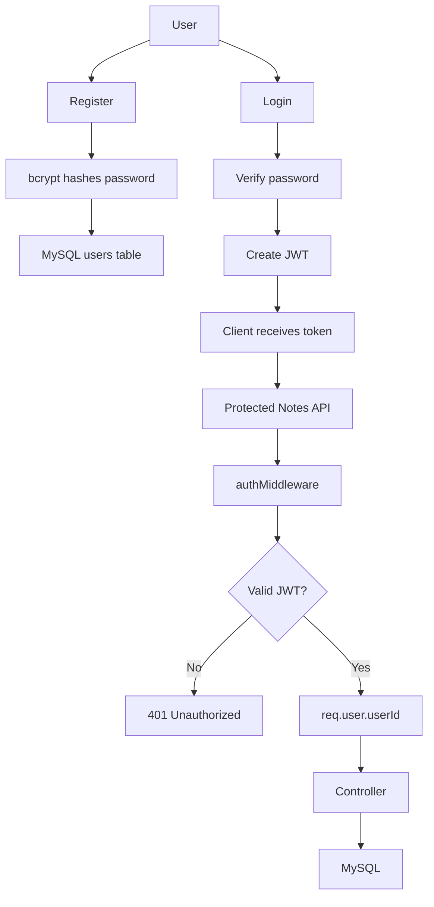
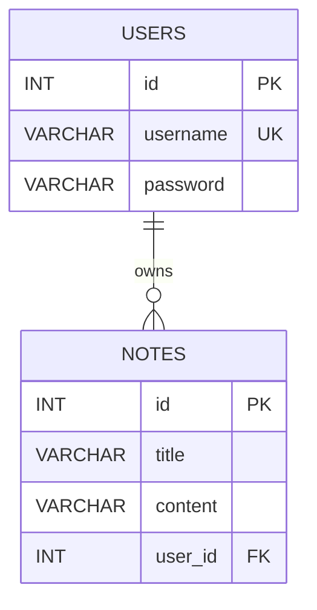

# 📝 Notes API

> A secure RESTful Notes API built with **Node.js, Express.js, MySQL, bcrypt, and JWT**.

The API supports user registration, login, authenticated CRUD operations for notes, validation, centralized error handling, and pagination.

Each note belongs to the authenticated user, so users can access and modify **only their own notes**.

---

## 📌 Table of Contents

- [✨ Features](#-features)
- [🛠️ Technologies Used](#️-technologies-used)
- [📁 Project Structure](#-project-structure)
- [🔐 Authentication Flow](#-authentication-flow)
- [🗄️ Database Design](#️-database-design)
- [⚙️ Environment Variables](#️-environment-variables)
- [🚀 Installation & Setup](#-installation--setup)
- [📚 API Documentation](#-api-documentation)
- [🧪 Validation](#-validation)
- [📄 Pagination](#-pagination)
- [⚠️ Error Handling](#️-error-handling)
- [📊 HTTP Status Codes](#-http-status-codes)
- [🔒 Security](#-security)
- [🔮 Future Improvements](#-future-improvements)

---

## ✨ Features

- 👤 User registration and login
- 🔑 JWT-based authentication
- 🔐 Password hashing with bcrypt
- 📝 Create, read, update, and delete notes
- 👥 User-specific note ownership
- 🛡️ Authorization — users can access only their own notes
- ✅ Request validation middleware
- 🆔 Note ID validation
- 📄 Pagination for notes
- ⚠️ Centralized error handling
- 🗃️ MySQL database integration
- 🔒 Environment variables for sensitive configuration

---

## 🛠️ Technologies Used

| Technology | Purpose |
|---|---|
| **Node.js** | JavaScript runtime |
| **Express.js** | REST API framework |
| **MySQL** | Relational database |
| **JavaScript** | Application logic |
| **JWT** | Authentication |
| **bcrypt** | Password hashing |
| **mysql2** | MySQL connection |
| **Thunder Client / Postman** | API testing |

---

## 📁 Project Structure

```text
Notes-API/
│
├── config/
│   └── db.js
│
├── controllers/
│   ├── notesController.js
│   └── userController.js
│
├── middleware/
│   ├── authMiddleware.js
│   ├── errorHandler.js
│   ├── idValidation.js
│   ├── noteValidation.js
│   ├── paginationValidation.js
│   └── userValidation.js
│
├── models/
│   ├── notesModel.js
│   └── userModel.js
│
├── routes/
│   ├── notesRoutes.js
│   └── userRoutes.js
│
├── .env
├── .gitignore
├── package.json
├── package-lock.json
├── server.js
└── README.md
```

<details>
<summary>📂 What does each folder do?</summary>

### `config/`
Handles the MySQL database connection.

### `controllers/`
Contains the main business logic and handles HTTP requests and responses.

### `models/`
Contains SQL queries and communicates with MySQL.

### `routes/`
Defines API endpoints and connects routes with middleware and controllers.

### `middleware/`
Handles authentication, validation, pagination, and centralized error handling.

### `server.js`
Entry point of the application. Configures Express, middleware, routes, and starts the server.

</details>

---

## 🔐 Authentication Flow

The application uses **JWT (JSON Web Token)** for authentication.



### Authorization Header

Protected APIs require:

```http
Authorization: Bearer YOUR_JWT_TOKEN
```

The server verifies the token and obtains the authenticated user's ID.

---

## 🗄️ Database Design

The application uses two main tables:

```text
users
-----------------
id          PK
username    UNIQUE
password


notes
-----------------
id          PK
title
content
user_id     FK
```

### Relationship



One user can have multiple notes.

Each note belongs to exactly one user.

---

## ⚙️ Environment Variables

Sensitive configuration is stored in `.env`.

Create a `.env` file in the project root:

```env
DB_HOST=localhost
DB_USER=your_mysql_username
DB_PASSWORD=your_mysql_password
DB_NAME=notes_db
DB_PORT=3306
JWT_SECRET=your_jwt_secret
PORT=3000
```

> ⚠️ **Never commit `.env` to GitHub.**

Make sure `.gitignore` contains:

```text
.env
node_modules/
```

---

## 🚀 Installation & Setup

Follow these steps to run the project locally.

### 1️⃣ Clone the repository

```bash
git clone YOUR_GITHUB_REPOSITORY_URL
cd Notes-API
```

### 2️⃣ Install dependencies

```bash
npm install
```

### 3️⃣ Configure environment variables

Create a `.env` file in the project root:

```env
DB_HOST=localhost
DB_USER=your_mysql_username
DB_PASSWORD=your_mysql_password
DB_NAME=notes_db
DB_PORT=3306
JWT_SECRET=your_jwt_secret
PORT=3000
```

> ⚠️ Never commit your `.env` file or real credentials to GitHub.

### 4️⃣ Set up the MySQL database

Create the database:

```sql
CREATE DATABASE notes_db;
```

Create the `users` table:

```sql
CREATE TABLE users (
    id INT AUTO_INCREMENT PRIMARY KEY,
    username VARCHAR(100) NOT NULL UNIQUE,
    password VARCHAR(255) NOT NULL
);
```

Create the `notes` table:

```sql
CREATE TABLE notes (
    id INT AUTO_INCREMENT PRIMARY KEY,
    title VARCHAR(255),
    content VARCHAR(255),
    user_id INT NOT NULL,
    FOREIGN KEY (user_id) REFERENCES users(id)
);
```

> 💡 If you already created the database and tables, you do not need to run these commands again.

### 5️⃣ Start the server

```bash
node server.js
```

Expected output:

```text
Server is running successfully on 3000 port
Database connected successfully
```

### 6️⃣ Test the API

The API is available at:

```text
http://localhost:3000
```

You can test the endpoints using **Thunder Client** or **Postman**.

---

# 📚 API Documentation

## 👤 User APIs

### Register

```http
POST /users/register
```

Request body:

```json
{
  "username": "sowjanya",
  "password": "mypassword123"
}
```

Example response:

```json
{
  "message": "User registered successfully",
  "id": 1
}
```

The password is hashed with bcrypt before being stored.

---

### Login

```http
POST /users/login
```

Request body:

```json
{
  "username": "sowjanya",
  "password": "mypassword123"
}
```

Example response:

```json
{
  "message": "Login successful",
  "token": "YOUR_JWT_TOKEN"
}
```

<details>
<summary>🔑 How to use the token</summary>

Copy the returned token and send it with protected requests:

```http
Authorization: Bearer YOUR_JWT_TOKEN
```

</details>

---

# 📝 Notes APIs

All Notes APIs require a valid JWT.

## GET `/notes`

Returns notes belonging to the authenticated user.

```http
GET /notes
```

Optional pagination:

```http
GET /notes?page=1&limit=10
```

Required header:

```http
Authorization: Bearer YOUR_JWT_TOKEN
```

Example response:

```json
{
  "page": 1,
  "limit": 10,
  "notes": [
    {
      "id": 1,
      "title": "Java",
      "content": "Learning Java",
      "user_id": 1
    }
  ]
}
```

---

## GET `/notes/:id`

Returns one note belonging to the authenticated user.

Example:

```http
GET /notes/1
```

Required header:

```http
Authorization: Bearer YOUR_JWT_TOKEN
```

Example response:

```json
{
  "id": 1,
  "title": "Java",
  "content": "Learning Java",
  "user_id": 1
}
```

---

## POST `/notes`

Creates a new note.

```http
POST /notes
```

Required header:

```http
Authorization: Bearer YOUR_JWT_TOKEN
```

Request body:

```json
{
  "title": "Java",
  "content": "Learning Java methods"
}
```

Example response:

```json
{
  "message": "Note created successfully",
  "id": 5
}
```

The `user_id` is automatically taken from the authenticated user's JWT.

The client does **not** provide the `user_id`.

---

## PUT `/notes/:id`

Updates an existing note owned by the authenticated user.

Example:

```http
PUT /notes/5
```

Required header:

```http
Authorization: Bearer YOUR_JWT_TOKEN
```

Request body:

```json
{
  "title": "Java Methods",
  "content": "Learning methods in Java"
}
```

Example response:

```json
{
  "message": "Note updated successfully"
}
```

---

## DELETE `/notes/:id`

Deletes an existing note owned by the authenticated user.

Example:

```http
DELETE /notes/5
```

Required header:

```http
Authorization: Bearer YOUR_JWT_TOKEN
```

Example response:

```json
{
  "message": "Note deleted successfully"
}
```

---

## 📋 API Summary

| Method | Endpoint | Description | Auth |
|---|---|---|:---:|
| `POST` | `/users/register` | Register a new user | ❌ |
| `POST` | `/users/login` | Login and receive JWT | ❌ |
| `GET` | `/notes` | Get authenticated user's notes | ✅ |
| `GET` | `/notes/:id` | Get a specific note | ✅ |
| `POST` | `/notes` | Create a note | ✅ |
| `PUT` | `/notes/:id` | Update a note | ✅ |
| `DELETE` | `/notes/:id` | Delete a note | ✅ |

---

## 🧪 Validation

The API validates incoming request data using middleware.

### User Validation

- Username is required.
- Password is required.
- Username must be at least 3 characters.
- Username cannot exceed 100 characters.
- Password must be at least 6 characters.

### Note Validation

- Title is required.
- Content is required.
- Title cannot exceed 100 characters.
- Content cannot exceed 5000 characters.

### ID Validation

Note IDs are validated before:

```text
GET /notes/:id
PUT /notes/:id
DELETE /notes/:id
```

Invalid IDs return `400 Bad Request`.

### Pagination Validation

- `page` must be a positive integer.
- `limit` must be a positive integer.
- `limit` cannot exceed 50.

---

## 📄 Pagination

The `GET /notes` endpoint supports pagination.

### Query Parameters

| Parameter | Description | Default |
|---|---|---:|
| `page` | Page number | `1` |
| `limit` | Number of notes per page | `10` |
| Maximum `limit` | Maximum notes returned per request | `50` |

Example:

```http
GET /notes?page=2&limit=10
```

The offset is calculated as:

```text
offset = (page - 1) × limit
```

For:

```text
page = 2
limit = 10
```

the offset is:

```text
offset = (2 - 1) × 10
       = 10
```

This allows the API to retrieve only the required records.

---

## ⚠️ Error Handling

The API uses centralized error-handling middleware.

Controllers pass unexpected errors to the error handler:

```javascript
next(error);
```

The centralized error handler returns an appropriate HTTP status code and message.

Common errors include:

- Invalid request data
- Invalid note ID
- Note not found
- Missing JWT
- Invalid JWT
- Expired JWT
- Database errors

---

## 📊 HTTP Status Codes

| Status | Meaning | Example |
|---:|---|---|
| `200` | OK | Successful GET, PUT, or DELETE |
| `201` | Created | User or note successfully created |
| `400` | Bad Request | Invalid input or ID |
| `401` | Unauthorized | Missing, invalid, or expired JWT |
| `404` | Not Found | Note does not exist or is not owned by the user |
| `500` | Internal Server Error | Unexpected server/database error |

### Quick reference

```text
400 → Your request is invalid.
401 → You are not authenticated.
404 → The resource was not found.
500 → Something went wrong on the server.
```

---

## 🔒 Security

The project follows several basic security practices:

- Passwords are hashed using bcrypt.
- JWT is used for authentication.
- JWT secrets are stored in environment variables.
- Database credentials are stored in environment variables.
- Parameterized SQL queries are used to reduce SQL injection risk.
- Users cannot directly choose the `user_id` when creating notes.
- Notes queries verify both the note ID and authenticated user ID.
- `.env` and `node_modules/` are excluded through `.gitignore`.

---

## 🔮 Future Improvements

Possible improvements for the next version:

- 🎨 Frontend application
- 🔄 Refresh tokens
- 🚪 Logout/token revocation strategy
- 📧 Email-based account recovery
- 🔍 Search and filtering
- 🗓️ Created/updated timestamps
- 🏷️ Note categories or tags
- 📑 OpenAPI/Swagger documentation
- 🧪 Automated API tests
- ☁️ Deployment to a cloud platform

---

## 👩‍💻 Author

**P. Lakshmi Sowjanya**

> Built as a learning project to understand REST APIs, authentication, authorization, database integration, middleware, and backend architecture.
